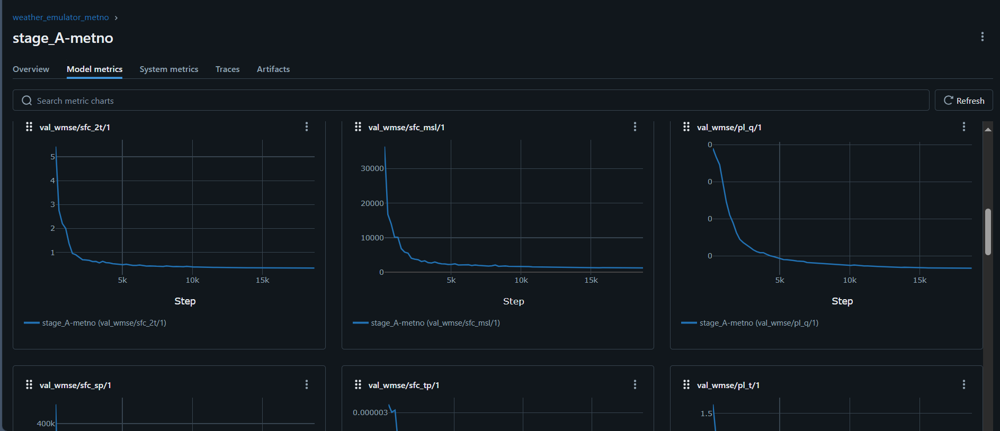
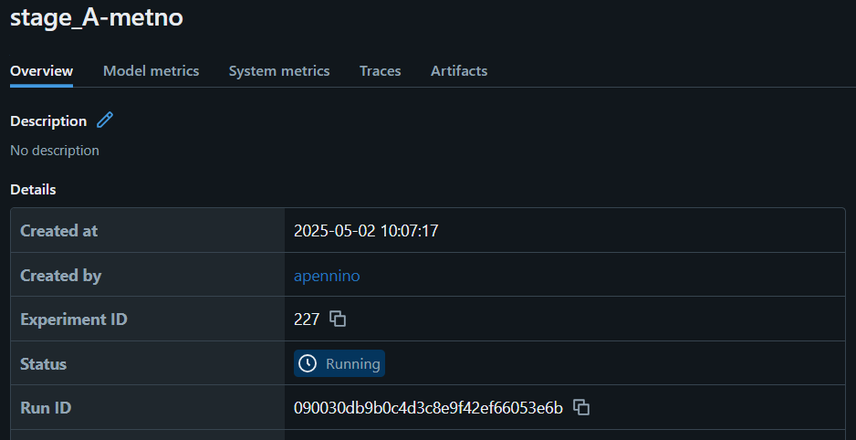

# 🌬️ anemoi-sandbox

A sandbox repository containing instructions and notebooks to train, evaluate, and use ML models using [Anemoi](https://www.ecmwf.int/en/about/media-centre/news/2024/anemoi-new-framework-weather-forecasting-based-machine-learning).

---

## 📚 Table of Contents

1. [Setup Environment](#setup-environment)  
2. [Config Archive](#config-archive)  
3. [Explore Anemoi Documentation](#explore-anemoi-documentation)  
4. [Example Training Run: GraphCast Global Model](#example-training-run-graphcast-global-model)  
5. [Run Lightweight Verification](#run-lightweight-verification)

---

## Setup Environment

Download a Python package manager like [Anaconda](https://www.anaconda.com/).

Create the environment:

```bash
conda create -n anemoi python=3.10 -y
conda activate anemoi
pip install torch torchvision torchaudio --index-url https://download.pytorch.org/whl/cu121
```

Install packages:

**Users:**

```bash
pip install anemoi-datasets
pip install anemoi-training==0.3.3
pip install anemoi-models==0.4.2
pip install anemoi-graphs==0.5.0
pip install anemoi-utils
pip install anemoi-inference
```

**Developers:**

```bash
pip install anemoi-utils

git clone git@github.com:ecmwf/anemoi-datasets.git
cd anemoi-datasets 
pip install -e .
cd ..

git clone git@github.com:ecmwf/anemoi-core.git
cd anemoi-core

cd graphs && pip install -e . && cd ..
cd models && pip install -e . && cd ..
cd training && pip install -e . && cd ..
cd ..

git clone git@github.com:ecmwf/anemoi-inference.git
cd anemoi-inference
pip install -e .
cd ..
```

Alternatively, refer to [anemoi-config](https://github.com/ecmwf/anemoi-configs).

---

## Config Archive

Anemoi relies on YAML configuration files to define pipelines.

You can find a full archive of MeteoSwiss use cases:

```bash
git clone git@github.com:MeteoSwiss/ml-pilot-anemoi.git
```
Please refer to [Hydra Introduction](hydra_intro.md) for more details about hydra configurations.

---

## 📘 Explore Anemoi Documentation

You can have a look at all available CLI command within anemoi in each documentation section:

- 📦 [anemoi-datasets](https://anemoi.readthedocs.io/projects/datasets/en/latest/cli/introduction.html)  
- 🔧 [anemoi-graphs](https://anemoi.readthedocs.io/projects/graphs/en/latest/cli/introduction.html)  
- 🏋️ [anemoi-training](https://anemoi.readthedocs.io/projects/training/en/latest/user-guide/training.html)  
- 📈 [anemoi-inference](https://anemoi.readthedocs.io/projects/inference/en/latest/cli/introduction.html)

---

## Example Training Run: GraphCast Global Model

Here is an example on how to setup a training run on a HPC using anemoi-training.

---

### 📥 Download Dataset
Download the ERA5 096 dataset from the [anemoi-catalogue](https://anemoi.ecmwf.int/).

```bash
anemoi-datasets copy --resume s3://ml-datasets/cerra-rr-an-oper-0001-mars-5p5km-1984-2020-3h-v2-rmi.zarr/ .
```

### ✏️ Adjust Config File

Update paths in config file: `configs/stage_A-metno.yaml`.

### 📝 Create SBATCH Script
Create the bash script called `stage_A-metno.sh` to submit the job on the HPC machine.

`stage_A-metno.sh`:

```bash
#!/bin/bash

#SBATCH --job-name="stage_A"
#SBATCH --partition=normal
#SBATCH --nodes=1
#SBATCH --ntasks-per-node=4
#SBATCH --gpus-per-node=4
#SBATCH --cpus-per-task=16
#SBATCH --mem=256G
#SBATCH --time=24:00:00
#SBATCH --no-requeue
#SBATCH --exclusive
#SBATCH --output=stage_A-metno.log
#SBATCH --error=stage_A-metno.err

echo "Running training job on $(hostname) at $(pwd)"

# Activate environment
source /users/apennino/.bashrc
conda activate anemoi

srun -u anemoi-training train \
    --config-dir="configs" \
    --config-name="stage_A-metno"
```

### 🚀 Launch Training
You can now launch the training job by:

```bash
sbatch stage_A-metno.sh
```

Monitor the training progress by checking the queue:

```bash
squeue -u YOUR-USERNAME
```

Or check the `.log` and `.err` files created by the script.

### 🧪 Monitoring Training Evolution

You can check the evolution of the training by checkig progress in the [MLFlow server](https://servicedepl.meteoswiss.ch/mlstore/#/experiments/1?searchFilter=&orderByKey=attributes.start_time&orderByAsc=false&startTime=ALL&lifecycleFilter=Active&modelVersionFilter=All+Runs&datasetsFilter=W10%3D).

You can find your specific run by looking at the values of `experiment_name` and `run_name`.



Please refer to [MLFlow Introduction](mlflow_intro.md) for more details about MLFlow monitoring.


## Run Lightweight Verification

Once your training is completed, anemoi generates a checkpoint file containing all model weights. 
You can find it by looking at the checkpoint path in the config file.

### 📥 Install Verification Tool

```
TODO: add path to new repo
```

### 🚧 Run Verification Script

1. Locate your `run_id` in MLflow.


2. Launch:

```bash
cd lightweight_verif
./submit_inference_array.sh 090030db9b0c4d3c8e9f42ef66053e6b -m stage_A-metno
```

---

### 📈 Verification Output

- `verif/`: metrics vs. analysis data  
- `plots/`: images and animations  
  
- `grib/`: GRIB files for NWP  
- `raw/`: raw NumPy predictions

---

